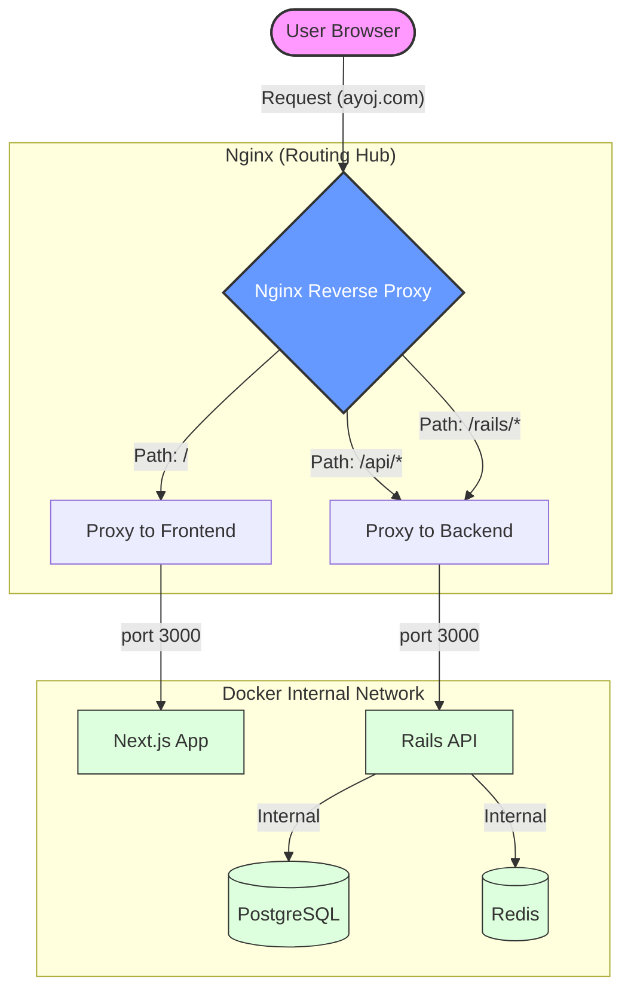

# Reverse Proxy Architecture: Nginx, Frontend, and Backend

This document explains how the Ayoj Marketplace uses Nginx as a Reverse Proxy to unify the Next.js frontend and Rails backend into a single, seamless application.

## 1. High-Level Flow

---

## 2. How it works in Ayoj

### The "Traffic Cop" Concept
Nginx acts as the single entry point (listening on port 80/443). Instead of the user talking directly to the frontend or backend, they talk only to Nginx. Nginx then looks at the **URL Path** to decide where to send the message.

### Routing Rules (from `docker/nginx/local.conf`)

| Request Path | Destination | Internal Logic |
| :--- | :--- | :--- |
| `localhost/` | **Frontend** | Direct pass to Next.js container. |
| `localhost/api/vendors` | **Backend** | Rewrites `/api/vendors` to `/vendors` and sends to Rails. |
| `localhost/up` | **Backend** | Direct pass to Rails health check. |
| `localhost/sidekiq` | **Backend** | Direct pass to Background Job dashboard. |

---

## 3. Why use this instead of a "Public URL" for Next.js?

While you can run Next.js and Rails on separate public URLs (e.g., `app.ayoj.com` and `api.ayoj.com`), the Reverse Proxy approach offers four critical advantages:

### A. Zero CORS Issues
Browsers block scripts on one domain (frontend) from talking to another (backend) for security. This is called **CORS**. 
*   **Without Proxy**: You must configure Rails to "allow" the frontend URL explicitly.
*   **With Proxy**: Since both are served from the same domain (`localhost`), the browser sees them as the same origin. **CORS effectively disappears.**

### B. Path Rewriting
The frontend can call `/api/services`. Nginx automatically strips the `/api` prefix before it hits Rails. This keeps your Rails routes clean (`/services`) while maintaining a logical structure for the frontend.

### C. Unified SSL Termination
In production, you only need **one** SSL certificate installed on Nginx. Nginx handles the heavy encryption/decryption work, and communicates with the internal containers over fast, unencrypted HTTP.

### D. Security & Obscurity
Your actual application servers (Next.js and Rails) are hidden inside a private Docker network. They don't even need to expose ports to the public internet. This makes it much harder for attackers to target your database or internal services directly.

---

## 4. Summary of Ties
*   **Next.js** handles the UI and initial page loads.
*   **Rails** handles the data, business logic, and database.
*   **Nginx** is the glue that makes them appear as one single application to the user.
